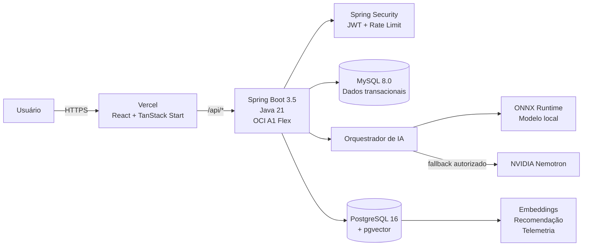
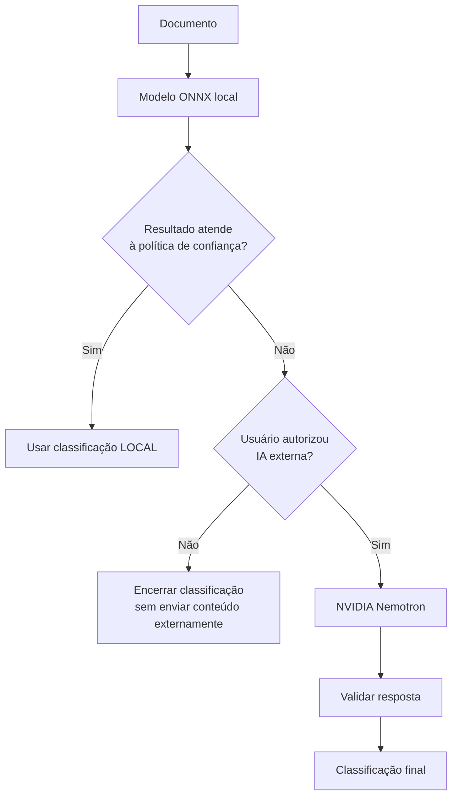
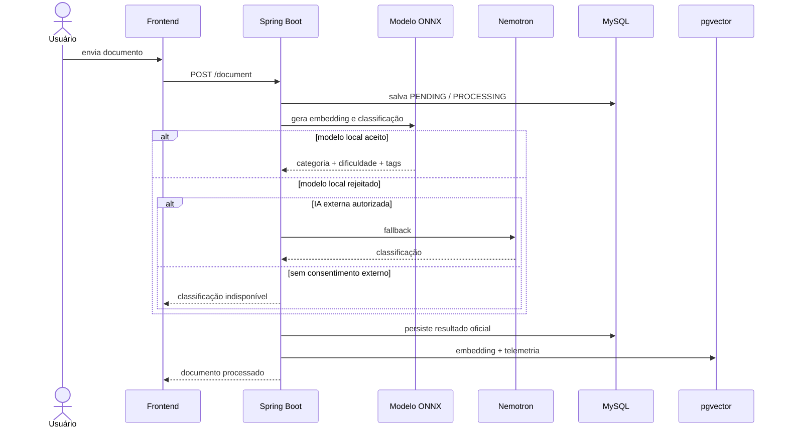

<div align="center">


# SCRIPTO

### Onde suas leituras se organizam.

**Uma plataforma inteligente para organizar, classificar, descobrir e recomendar conteúdos textuais com IA híbrida, busca semântica e processamento local.**

<br/>


<br/>

[Visão geral](#-sobre-o-projeto) •
[Funcionalidades](#-principais-funcionalidades) •
[Arquitetura](#-arquitetura) •
[IA](#-inteligência-artificial) •
[Como executar](#-executando-localmente) •
[Testes](#-testes-e-qualidade) •
[Documentação](#-documentação-técnica)

</div>

---

## 📌 Sobre o projeto

O **Scripto** nasceu para resolver um problema simples, mas recorrente: quanto mais conteúdos salvamos para estudar, consultar ou ler depois, mais difícil fica **organizar, encontrar e priorizar aquilo que realmente importa**.

A plataforma centraliza documentos textuais em uma biblioteca pessoal e utiliza Inteligência Artificial para enriquecer automaticamente cada conteúdo com:

- **categoria**;
- **nível de dificuldade**;
- **tags**;
- **embedding semântico**;
- **recomendações relacionadas**;
- **resumo sob demanda**.

O diferencial técnico está na forma como essa inteligência foi construída: o Scripto possui um **modelo interno executado diretamente no backend Java através do ONNX Runtime**, sem depender de um serviço Python em produção. Quando a classificação local não atende à política de confiança, o sistema pode recorrer a um modelo externo como fallback — **somente quando autorizado pelo usuário**.

Além da experiência principal de biblioteca, o projeto contempla autenticação, gerenciamento de conta, exploração de conteúdos públicos, recomendação vetorial, denúncias, moderação, painel administrativo e coleta consentida de exemplos para evolução futura do modelo interno.

> **Contexto:** projeto desenvolvido no ecossistema do **Hackathon ONE — Oracle Next Education**, integrando desenvolvimento Full Stack, Data Science, IA e infraestrutura em nuvem.

---

## 👀 Para quem está avaliando o projeto

Se este é o seu primeiro contato com o Scripto, estes são os pontos que melhor representam as decisões técnicas do projeto:

| Destaque | O que foi implementado |
|---|---|
| 🧠 **IA local em Java** | Encoder multilíngue exportado para ONNX e executado dentro do Spring Boot |
| 🔀 **Pipeline híbrido** | Modelo local como primeira opção + fallback Nemotron controlado por política e consentimento |
| 🔎 **Busca semântica** | Embeddings de 384 dimensões armazenados em PostgreSQL + pgvector |
| 🗄️ **Persistência poliglota** | MySQL como sistema transacional e PostgreSQL dedicado ao workload vetorial |
| 🔐 **Segurança** | JWT, Spring Security, roles administrativas, BCrypt e rate limiting |
| 📚 **Produto completo** | Biblioteca, exploração, perfil, upload, recomendação, resumos, denúncias e administração |
| ☁️ **Deploy real** | Frontend na Vercel e backend + dados + IA em Oracle Cloud Infrastructure |
| 🧪 **Qualidade** | Testes automatizados no backend, type-check, lint, build e documentação arquitetural detalhada |

### Caminho rápido de avaliação

1. Veja a [arquitetura](doc/ARCHITECTURE.md).
2. Entenda o [modelo interno de IA](doc/AI_MODEL.md).
3. Consulte a [API Java](doc/BACKEND_API.md).
4. Veja a arquitetura do [frontend](doc/FRONTEND.md).
5. Confira a estratégia de [testes](doc/TESTING.md).
6. Para reproduzir localmente, siga [desenvolvimento local](doc/LOCAL_DEVELOPMENT.md).

---

## ✨ Principais funcionalidades

### 👤 Conta e autenticação

- cadastro de usuário;
- login com JWT;
- perfil e estatísticas;
- alteração de dados;
- suspensão e reativação de conta;
- ciclo de exclusão lógica com janela de reativação;
- autorização por perfil de acesso.

### 📚 Biblioteca pessoal

- envio de documentos;
- processamento automático pela IA;
- visualização de categoria, dificuldade e tags;
- gerenciamento da própria biblioteca;
- definição de visibilidade pública/privada;
- geração de resumo sob demanda;
- descoberta de conteúdos relacionados.

### 🌎 Exploração

- acesso a conteúdos públicos;
- filtragem e descoberta;
- recomendações com base no histórico da biblioteca;
- recomendação semântica entre documentos.

### 🧠 Inteligência Artificial

- classificação local;
- detecção de baixa confiança;
- detecção de conteúdo fora da distribuição esperada;
- fallback externo condicionado a consentimento;
- classificação de dificuldade;
- geração automática de tags;
- geração de embeddings;
- recomendação vetorial;
- registro de eventos de inferência;
- curadoria consentida de candidatos para evolução do modelo.

### 🛡️ Administração e moderação

- dashboard administrativo;
- gerenciamento de usuários;
- gerenciamento de documentos;
- denúncias;
- moderação de conteúdo;
- curadoria de candidatos de treinamento.

---

## 🏗️ Arquitetura

O Scripto utiliza uma arquitetura web desacoplada, com **frontend independente**, **API REST stateless**, **persistência poliglota** e um **pipeline híbrido de IA**.



### Responsabilidade de cada camada

| Camada | Responsabilidade |
|---|---|
| **React / TanStack Start** | interface, rotas, experiência do usuário e integração HTTP |
| **Spring Boot** | regras de negócio, segurança, API REST e orquestração |
| **MySQL** | fonte transacional oficial da aplicação |
| **PostgreSQL + pgvector** | embeddings, similaridade, eventos de IA e candidatos de treinamento |
| **ONNX Runtime** | inferência do modelo interno dentro do processo Java |
| **Nemotron** | fallback de classificação e geração de resumos |
| **Vercel** | entrega do frontend e CDN |
| **OCI** | execução do backend, modelo local e bancos de dados |

---

## ☁️ Arquitetura de produção

O deploy foi estruturado para aproveitar a infraestrutura da **Oracle Cloud Infrastructure** junto à distribuição global do frontend pela **Vercel**.

```text
┌──────────────────────────────────────────────────────────────────────┐
│                         VERCEL — FRONTEND                            │
│                                                                      │
│                    React + TanStack Start                            │
│                     HTTPS + CDN Global                               │
└───────────────────────────────┬──────────────────────────────────────┘
                                │
                                │  vercel.json
                                │  /api/* → OCI A1 :8080/*
                                ▼
┌──────────────────────────────────────────────────────────────────────┐
│                OCI A1 FLEX — 2 OCPU / 12 GB RAM                     │
│                                                                      │
│   ┌────────────────────┐  ┌───────────────────┐  ┌────────────────┐ │
│   │ Spring Boot 3.5    │  │ MySQL 8.0        │  │ Modelo ONNX    │ │
│   │ Java 21            │  │ Docker            │  │ ~467 MB       │ │
│   │ :8080              │  │ :3306             │  │ IA local      │ │
│   └─────────┬──────────┘  └───────────────────┘  └────────────────┘ │
│             │                                                        │
└─────────────┼────────────────────────────────────────────────────────┘
              │
              │ Rede privada OCI / VCN
              │ 10.0.10.0/24
              ▼
┌──────────────────────────────────────────────────────────────────────┐
│                    OCI AMD MICRO — 1 GB RAM                          │
│                                                                      │
│               PostgreSQL 16 + pgvector :5432                        │
│                                                                      │
│    embeddings • busca vetorial • telemetria • training candidates   │
└──────────────────────────────────────────────────────────────────────┘
```

### Por que separar os bancos?

O projeto utiliza **persistência poliglota**:

- **MySQL** mantém o estado transacional que governa o produto;
- **PostgreSQL + pgvector** atende operações vetoriais e dados relacionados à IA.

Isso mantém responsabilidades separadas e evita forçar workloads vetoriais sobre o banco transacional principal.

> A comunicação entre os dois bancos não utiliza transação distribuída XA. O backend trata o processamento como um workflow com semântica própria.

---

## 🧠 Inteligência Artificial

Uma das principais decisões do Scripto foi evitar que toda classificação dependesse de uma API externa.

### Modelo interno

O backend carrega um bundle previamente treinado em:

```text
backend/models/scripto-model-v3/
├── manifest.json
├── scripto_runtime_bundle.json
├── evaluation_metrics.json
├── onnx_export_validation.json
├── parity_test.json
└── embedding/
    ├── model.onnx
    ├── tokenizer.json
    ├── tokenizer_config.json
    ├── config.json
    └── onnx_contract.json
```

O runtime **não depende de Python**.

O Java executa o encoder usando **ONNX Runtime**, produz o embedding e aplica os classificadores exportados.

### Encoder semântico

| Propriedade | Valor |
|---|---|
| Modelo base | `sentence-transformers/paraphrase-multilingual-MiniLM-L12-v2` |
| Dimensão do embedding | **384** |
| Idiomas principais | **pt-BR / inglês** |
| Máximo de tokens | **128** |
| Pooling | Mean Pooling |
| Normalização | L2 |
| Formato | ONNX |
| Opset | 17 |

### O que o modelo prevê?

#### Categoria

O classificador local trabalha diretamente com **48 classes suportadas**, dentro de uma taxonomia final que também contempla `Other`.

#### Dificuldade

O sistema classifica o conteúdo como:

- `BEGINNER`;
- `INTERMEDIATE`;
- `ADVANCED`.

A decisão usa features textuais específicas além do embedding, como tamanho, diversidade lexical, densidade de marcadores técnicos e estrutura do documento.

#### Tags

O bundle contém **150 classes de tags**, com thresholds independentes e seleção de até cinco tags por documento.

---

## 🔀 Estratégia local-first + fallback

A IA externa não é chamada indiscriminadamente.



A política local considera, entre outros fatores:

- confiança da categoria;
- confiança da dificuldade;
- presença de tags válidas;
- categoria não suportada;
- detecção **Out-of-Distribution (OOD)**;
- erros de execução ou embedding inválido.

Essa abordagem permite combinar:

**privacidade + controle + custo operacional + qualidade de fallback.**

---

## 🔎 Recomendação semântica

Cada documento processado pode ter um embedding de **384 dimensões** armazenado no PostgreSQL.

Para recomendação entre documentos, o sistema consulta o pgvector por similaridade cosseno e combina sinais adicionais:

```text
score =
    0.70 × similaridade semântica
  + 0.20 × similaridade de tags
  + 0.10 × correspondência de categoria
```

O resultado é uma recomendação que vai além da comparação por palavras-chave.

A área de exploração também utiliza afinidade de categorias e tags do histórico do usuário para ordenar conteúdos públicos.

---

## 🤖 Resumos com IA

O resumo é uma funcionalidade independente da classificação local.

Quando solicitado:

1. o backend verifica se o usuário pode acessar o documento;
2. procura um resumo já existente em cache;
3. se não existir, utiliza o Nemotron;
4. valida e limita o resultado;
5. persiste o resumo para reutilização.

A aplicação possui controle de cota para evitar gerações desnecessárias.

---

## 🔐 Segurança e privacidade

O backend foi construído considerando autorização no servidor como fonte de verdade.

Principais mecanismos:

- **Spring Security**;
- autenticação **JWT**;
- tokens com expiração;
- senhas com **BCrypt**;
- autorização por roles;
- proteção das rotas administrativas;
- rate limiting em operações sensíveis;
- validação de entrada com Bean Validation;
- tratamento centralizado de erros;
- secrets fora do versionamento;
- consentimentos separados para IA externa e retenção destinada à evolução do modelo.

> As proteções de rota no frontend existem para experiência do usuário. A autorização efetiva ocorre no backend.

Detalhes: [`doc/SECURITY.md`](doc/SECURITY.md).

---

## 🧰 Stack tecnológica

### Frontend

- React 19;
- TypeScript;
- TanStack Start;
- TanStack Router;
- TanStack Query;
- Vite 8;
- Tailwind CSS 4;
- Radix UI;
- React Hook Form;
- Zod;
- Axios;
- Framer Motion.

### Backend

- Java 21;
- Spring Boot 3.5;
- Spring Web;
- Spring Security;
- Spring Data JPA;
- Spring Validation;
- Flyway;
- Maven;
- Bucket4j;
- Auth0 Java JWT;
- springdoc OpenAPI.

### IA e dados

- ONNX Runtime;
- DJL Hugging Face Tokenizers;
- Sentence Transformers;
- NVIDIA Nemotron;
- MySQL 8.0;
- PostgreSQL 16;
- pgvector;
- índice vetorial HNSW.

### Infraestrutura

- Oracle Cloud Infrastructure;
- OCI Ampere A1 Flex;
- OCI AMD Micro;
- Docker;
- Docker Compose;
- Vercel.

---

## 📂 Estrutura do repositório

```text
S1-BR-G9-TEAM07-Scripto/
│
├── backend/
│   ├── models/
│   │   └── scripto-model-v3/       # bundle ONNX utilizado em runtime
│   ├── src/
│   │   ├── main/java/              # aplicação Spring Boot
│   │   ├── main/resources/         # config, Flyway e documentação da API
│   │   └── test/java/              # testes automatizados
│   ├── docker/
│   ├── docker-compose.yml
│   └── pom.xml
│
├── frontend/
│   ├── public/
│   ├── src/
│   │   ├── assets/
│   │   ├── components/
│   │   ├── hooks/
│   │   ├── routes/
│   │   └── services/
│   ├── package.json
│   ├── vite.config.ts
│   └── vercel.json
│
├── data/
│   └── ...                         # notebooks e histórico de Data/IA
│
├── docs/                            # documentação histórica
│
├── doc/                             # documentação técnica consolidada
│   ├── ARCHITECTURE.md
│   ├── AI_MODEL.md
│   ├── BACKEND_API.md
│   ├── DATABASES.md
│   ├── DEPLOYMENT_OCI_VERCEL.md
│   ├── ENVIRONMENT_VARIABLES.md
│   ├── FRONTEND.md
│   ├── LOCAL_DEVELOPMENT.md
│   ├── OPERATIONS.md
│   ├── SECURITY.md
│   ├── TESTING.md
│   └── ...
│
└── README.md
```

---

## 🚀 Executando localmente

### Pré-requisitos

Antes de iniciar, tenha instalado:

- **JDK 21**;
- **Docker** e Docker Compose;
- **Node.js 22.12+**;
- npm;
- artefatos do modelo em `backend/models/scripto-model-v3/`.

A chave NVIDIA é necessária apenas para funcionalidades que utilizam o Nemotron.

---

### 1. Clone o projeto

```bash
git clone https://github.com/No-Country-simulation/S1-BR-G9-TEAM07-Scripto.git

cd S1-BR-G9-TEAM07-Scripto
```

---

### 2. Configure o backend

```bash
cd backend

cp .env.example .env
```

Preencha as variáveis necessárias no `.env`.

Para desenvolvimento, os principais serviços são:

```bash
docker compose up -d mysql postgres
```

Em seguida:

```bash
./mvnw spring-boot:run
```

Backend:

```text
http://localhost:8080
```

---

### 3. Configure o frontend

Em outro terminal:

```bash
cd frontend

cp .env.example .env

npm ci
npm run dev
```

Frontend:

```text
http://localhost:3000
```

Em desenvolvimento, o frontend utiliza `/api` e o Vite encaminha as chamadas para o backend local.

---

## 📖 API e documentação interativa

Com o backend em execução:

| Recurso | URL |
|---|---|
| Documentação customizada | `http://localhost:8080/docs` |
| Swagger UI | `http://localhost:8080/swagger-ui.html` |
| OpenAPI JSON | `http://localhost:8080/v3/api-docs` |
| Health Check | `http://localhost:8080/actuator/health` |

Endpoints protegidos esperam:

```http
Authorization: Bearer <jwt>
```

A descrição completa da API está em [`doc/BACKEND_API.md`](doc/BACKEND_API.md).

---

## 🔄 Exemplo do fluxo de processamento



---

## 🧪 Testes e qualidade

### Backend

Execute:

```bash
cd backend
./mvnw clean test
```

O backend possui uma suíte automatizada cobrindo áreas como:

- autenticação;
- JWT;
- rate limiting;
- usuários;
- validações de documentos;
- matemática do classificador;
- política de fallback;
- tags;
- cotas de resumo.

Na versão analisada do repositório existem:

- **16 classes de teste**;
- **55 métodos `@Test`**.

### Frontend

```bash
cd frontend

npm run type-check
npm run lint
npm run build
```

O frontend atualmente utiliza validações estáticas e de build. A evolução para testes unitários/componentes e E2E está registrada na estratégia de qualidade.

Veja [`doc/TESTING.md`](doc/TESTING.md).

---

## 📊 Avaliação do modelo interno

Além da implementação, o repositório mantém artefatos de avaliação do bundle utilizado em runtime.

### Teste interno

| Métrica | Resultado |
|---|---:|
| Acurácia de categoria | **98,78%** |
| F1 macro de categoria | **96,65%** |
| Cobertura após política | **92,24%** |
| Precisão entre inferências aceitas | **99,56%** |
| Acurácia de dificuldade | **83,27%** |
| F1 micro de tags | **98,93%** |

O projeto também mantém avaliação em golden set separado. Os resultados mostram queda relevante fora da distribuição interna, razão pela qual a arquitetura **não confia cegamente no classificador local** e aplica thresholds, OOD e fallback.

Essa diferença é documentada explicitamente em vez de ocultada, pois representa uma decisão importante de engenharia de ML: **medir generalização e tratar incerteza como parte do produto**.

Detalhes e métricas completas em [`doc/AI_MODEL.md`](doc/AI_MODEL.md).

---

## 🗃️ Bancos de dados

### MySQL — sistema de registro

Responsável pelas entidades que definem o estado oficial da aplicação:

- usuários;
- documentos;
- análises de IA;
- tags;
- resumos;
- denúncias;
- controle de uso.

O schema é versionado com **Flyway**.

### PostgreSQL + pgvector

Responsável por:

- embeddings;
- busca vetorial;
- eventos de inferência;
- candidatos consentidos para treinamento;
- recomendação semântica.

A correlação entre os bancos é feita por identificadores lógicos.

Mais detalhes: [`doc/DATABASES.md`](doc/DATABASES.md).

---

## 📚 Documentação técnica

A pasta [`doc/`](doc/) concentra a documentação arquitetural atual do projeto.

| Documento | Conteúdo |
|---|---|
| [`ARCHITECTURE.md`](doc/ARCHITECTURE.md) | componentes, fluxos e decisões arquiteturais |
| [`AI_MODEL.md`](doc/AI_MODEL.md) | modelo ONNX, classificação, thresholds, fallback e métricas |
| [`BACKEND_API.md`](doc/BACKEND_API.md) | módulos Java, API REST e contratos |
| [`FRONTEND.md`](doc/FRONTEND.md) | estrutura React/TanStack e integração |
| [`DATABASES.md`](doc/DATABASES.md) | MySQL, PostgreSQL e pgvector |
| [`DEPLOYMENT_OCI_VERCEL.md`](doc/DEPLOYMENT_OCI_VERCEL.md) | infraestrutura e deploy |
| [`SECURITY.md`](doc/SECURITY.md) | autenticação, autorização e hardening |
| [`TESTING.md`](doc/TESTING.md) | testes existentes e estratégia de qualidade |
| [`LOCAL_DEVELOPMENT.md`](doc/LOCAL_DEVELOPMENT.md) | setup completo do ambiente |
| [`ENVIRONMENT_VARIABLES.md`](doc/ENVIRONMENT_VARIABLES.md) | configuração por ambiente |
| [`OPERATIONS.md`](doc/OPERATIONS.md) | operação, logs, backup e troubleshooting |
| [`CONTRIBUTING.md`](doc/CONTRIBUTING.md) | convenções de contribuição |
| [`TECHNICAL_DEBT.md`](doc/TECHNICAL_DEBT.md) | trade-offs e evolução técnica |

---

## 🧭 Decisões de arquitetura que merecem destaque

### Por que ONNX dentro do Spring Boot?

Para eliminar a necessidade de manter um segundo serviço Python apenas para inferência.

Isso reduz:

- número de processos;
- complexidade operacional;
- comunicação de rede;
- pontos de falha.

E mantém a classificação local no mesmo runtime que já controla autenticação e regras de negócio.

### Por que um fallback externo?

Porque confiança do modelo não deve ser confundida com certeza.

Quando a política detecta uma inferência local de baixa qualidade, o sistema prefere rejeitá-la e usar fallback autorizado a persistir silenciosamente uma classificação duvidosa.

### Por que pgvector?

Porque recomendação semântica exige comparar **significado**, não apenas strings.

O pgvector permite manter os vetores junto a um banco relacional conhecido, sem introduzir uma infraestrutura vetorial dedicada para a escala atual do projeto.

### Por que dois bancos?

Porque os dados transacionais e os dados vetoriais possuem características de acesso diferentes.

O MySQL permanece como fonte de verdade do domínio; o PostgreSQL atende o pipeline semântico.

---

## ⚠️ Trade-offs conhecidos

Como qualquer projeto real, algumas decisões envolvem compromissos.

Entre os pontos já identificados e documentados:

- MySQL e PostgreSQL não compartilham transação distribuída;
- o modelo ONNX aumenta o tamanho do artefato de deploy;
- resumos dependem de conectividade com o provedor externo;
- o frontend ainda não possui suíte automatizada de componentes/E2E;
- o schema vetorial deve evoluir para migrations versionadas;
- a comunicação Vercel → origem OCI deve ser endurecida com TLS/reverse proxy em uma evolução de produção.

Esses itens estão detalhados em [`doc/TECHNICAL_DEBT.md`](doc/TECHNICAL_DEBT.md).

---

## 👥 Equipe

| Integrante | Atuação |
|---|---|
| **Beatriz França Gusmão** | Full Stack |
| **Daniel Romulo Gomes** | Back-end |
| **Davenir Ramos** | Back-end |
| **José Carlos G. Júnior** | Back-end |
| **Juliana Magalhães** | Data Scientist |
| **Maria Gomes** | Data Scientist |
| **Vitor Augusto R. Genesio** | Back-end |

---

## 🤝 Contribuindo

O fluxo recomendado é:

```bash
git checkout -b feature/minha-feature
```

Após implementar e validar:

```bash
git add .
git commit -m "feat: descreve a alteração"
git push origin feature/minha-feature
```

Então abra um Pull Request.

Antes do PR, execute sempre que aplicável:

```bash
# backend
./mvnw test

# frontend
npm run type-check
npm run lint
npm run build
```

Consulte [`doc/CONTRIBUTING.md`](doc/CONTRIBUTING.md) para as convenções completas.

---

## 🔒 Secrets

Nunca versione:

- `.env`;
- `JWT_SECRET`;
- credenciais MySQL/PostgreSQL;
- `NVIDIA_API_KEY`;
- tokens pessoais;
- dumps contendo dados reais.

Use os arquivos `.env.example` apenas como referência de configuração.

---

<div align="center">

## 📚 Scripto

**Organização de conteúdo + IA local + busca semântica + engenharia Full Stack.**

Construído com **Java, Spring Boot, React, TypeScript, ONNX, MySQL, PostgreSQL, pgvector, OCI e Vercel**.

<br/>

**[⬆ Voltar ao início](#scripto)**

</div>
