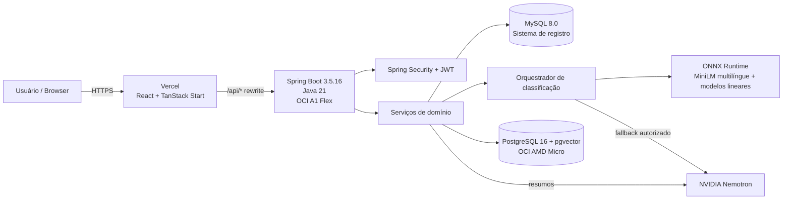
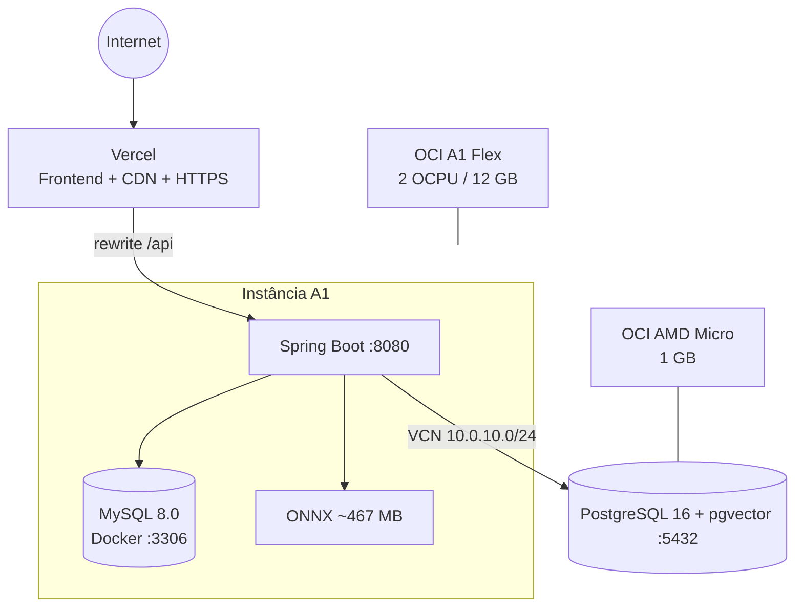

# Arquitetura do Scripto

## 1. Visão arquitetural

O Scripto adota uma arquitetura web em camadas, com **frontend desacoplado**, **API REST stateless**, **persistência poliglota** e **pipeline híbrido de IA**.



### Drivers arquiteturais

1. **Baixo custo operacional:** modelo local e infraestrutura dimensionada para recursos gratuitos do projeto.
2. **Privacidade por consentimento:** chamada externa de classificação somente quando explicitamente permitida.
3. **Degradação controlada:** o modelo local é preferencial; pgvector é uma dependência secundária para recomendação/telemetria, embora a retenção consentida no envio tenha semântica mais forte.
4. **Fonte transacional única:** MySQL armazena o estado oficial do produto.
5. **Separação de workloads:** embeddings e corpus técnico ficam em PostgreSQL/pgvector separado.
6. **Frontend independente:** Vercel entrega a UI e funciona como gateway de caminho `/api`.

## 2. Componentes

### Frontend

Responsável por experiência do usuário, roteamento, estado de sessão e consumo da API. Não contém regra de autorização confiável: `ProtectedRoute` e `AdminRoute` são barreiras de UX; a decisão de segurança final pertence ao Spring Security.

### API Spring Boot

Organizada por feature/package:

```text
com.scripto.backend
├── admin            # dashboard e gestão administrativa
├── aianalyse        # entidade/DTO do resultado de IA persistido
├── auth             # DTOs de autenticação
├── classification   # engine local, fallback e validação
├── config           # datasource, security, Swagger e MVC
├── document         # documentos, persistência e processamento
├── exception        # erros de domínio/HTTP
├── recommendation   # recomendação vetorial e exploração
├── report           # denúncias e moderação
├── security         # JWT, authorization e rate limiting
├── summary          # resumo Nemotron, cache e quota
├── tag              # tags normalizadas
├── user             # conta, perfil e lifecycle
└── vector           # pgvector, embeddings e training candidates
```

### MySQL — sistema de registro

Armazena entidades de negócio que determinam o estado oficial da plataforma: usuários, documentos, análises, tags, resumos, denúncias e uso diário de IA.

### PostgreSQL + pgvector

Armazena:

- embeddings dos documentos;
- eventos de inferência;
- snapshots consentidos para curadoria/treinamento;
- índice HNSW para similaridade cosseno.

Não há foreign keys cross-database para MySQL; a correlação usa `document_id` lógico.

### Modelo local ONNX

O backend carrega um encoder ONNX de 384 dimensões e parâmetros de classificadores lineares armazenados em `scripto_runtime_bundle.json`. Não existe servidor Python no runtime.

### NVIDIA Nemotron

Possui duas responsabilidades:

- fallback de classificação, apenas quando a política local rejeita a inferência **e** `externalAiAllowed=true`;
- geração de resumos sob demanda.

## 3. Fluxo de criação de documento

```mermaid
stateDiagram-v2
    [*] --> PENDING: persistência inicial
    PENDING --> PROCESSING: início da classificação
    PROCESSING --> PROCESSED: classificação + retenção concluídas
    PROCESSING --> [*]: falha; documento é descartado e erro técnico é registrado
```



Apesar de existir o enum/status `ERROR`, a implementação atual de falha chama `discardFailed`: documentos que falham no processamento são removidos da operação e um motivo técnico genérico pode ser preservado em `document_processing_errors`.

### Etapas

1. `POST /document` valida título, conteúdo, termos e consentimento de treinamento.
2. `DocumentPersistenceService` grava o documento como `PENDING` e em seguida `PROCESSING`.
3. `ClassificationOrchestrator` tenta o modelo local.
4. A política local avalia categoria, confiança, OOD, dificuldade e tags.
5. Se aceito, o resultado `LOCAL` é usado.
6. Se rejeitado, Nemotron só pode ser chamado quando `externalAiAllowed=true`.
7. Resultado final é validado e persistido no MySQL.
8. Embedding/evento/candidato consentido são persistidos no PostgreSQL/pgvector.
9. O documento passa a `PROCESSED`.
10. Qualquer exceção no fluxo dispara descarte do documento em falha.

## 4. Recomendação

Há dois mecanismos diferentes.

### Recomendação por documento

Para `GET /document/{id}/recommendations`, o backend:

1. obtém o embedding do documento de origem;
2. busca vizinhos no pgvector por similaridade cosseno;
3. filtra apenas documentos públicos, aprovados, processados e de outros usuários;
4. calcula score composto:

```text
score = 0,70 * similaridade_semântica
      + 0,20 * Jaccard(tags)
      + 0,10 * correspondência_de_categoria
```

O endpoint limita o resultado final a no máximo 3 recomendações.

### Recomendações de exploração

`GET /explore/recommendations` usa o histórico da própria biblioteca para medir afinidade de categoria e tags:

```text
score = 0,60 * afinidade_categoria + 0,40 * afinidade_tags
```

## 5. Resumos

O resumo é gerado pelo Nemotron, persistido em `document_summaries` e reutilizado por cache. O limite é de **3 novas gerações por usuário/dia**, calculado no fuso `America/Sao_Paulo`. A leitura de um resumo já cacheado não consome nova geração.

## 6. Segurança arquitetural

- API stateless;
- JWT HMAC-SHA256 com 2 horas de expiração;
- endpoints `/admin/**` exigem `ROLE_ADMIN`;
- login/reativação/troca de senha suspensa têm rate limit por IP;
- senhas usam `BCryptPasswordEncoder`;
- rotas públicas não recebem JWT pelo interceptor do frontend;
- o conteúdo só entra no corpus de treinamento quando há consentimento explícito;
- classificação externa depende de consentimento separado.

Detalhes em [`SECURITY.md`](SECURITY.md).

## 7. Deployment view



## 8. Limites e trade-offs

- PostgreSQL e MySQL não compartilham transação distribuída; o código precisa definir compensação/semântica de falha.
- O backend é uma única aplicação Spring Boot; é simples de operar, mas compartilha CPU/RAM entre API, ONNX e tarefas administrativas.
- O ONNX de ~467 MB é copiado para a imagem Docker; build e distribuição ficam pesados.
- A aplicação depende de Nemotron para resumos; sem chave/conectividade, classificação local pode funcionar, mas resumo não.
- O frontend armazena JWT em `localStorage`, o que simplifica SPA/SSR client-side, mas aumenta a importância de prevenção contra XSS.
- O banco vetorial inicializa esquema via código (`PostgresVectorStore`) e não por migrations versionadas, o que reduz auditabilidade de evolução do schema.
