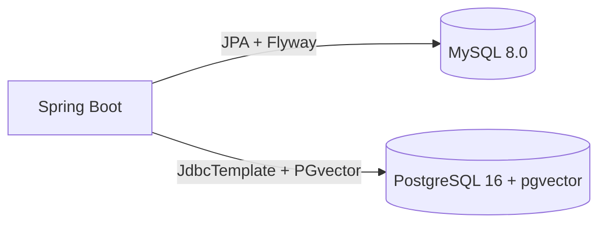
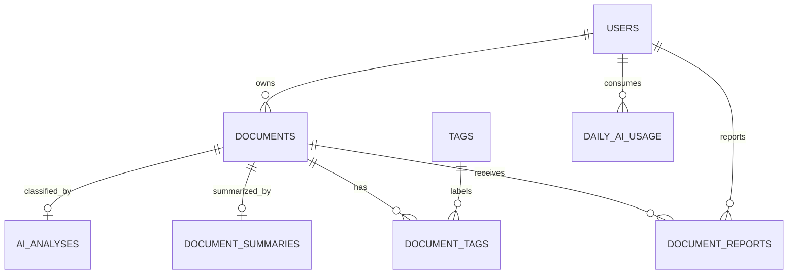

# Persistência e bancos de dados

## 1. Estratégia de persistência

O Scripto usa **persistência poliglota**:

- **MySQL 8.0:** fonte de verdade transacional do produto;
- **PostgreSQL 16 + pgvector:** embeddings, observabilidade de inferência e corpus consentido para evolução do modelo.



## 2. MySQL

Configuração:

- datasource principal do Spring;
- HikariCP;
- `spring.jpa.hibernate.ddl-auto=validate`;
- migrations via Flyway;
- timezone JDBC UTC.

### Tabelas atuais pelas migrations

#### `users`

Responsável por identidade e lifecycle:

- `id`;
- `full_name`;
- `cpf` único;
- `email` único;
- `password_hash`;
- `active`;
- `version`;
- `role` (`USER`, `ADMIN`);
- `banned` / `banned_at`;
- tentativas/último login;
- `deleted_at` para soft-delete;
- aceite/versionamento de termos;
- timestamps.

#### `documents`

- usuário proprietário;
- título/conteúdo;
- status de processamento;
- visibilidade (`PRIVATE`, `PUBLIC`);
- moderação (`APPROVED`, `PENDING`, `BLOCKED`);
- consentimento de IA externa;
- consentimento e versão para treinamento;
- aceite/versionamento de termos de uso;
- timestamps.

#### `ai_analyses`

Relação 1:1 lógica com documento:

- categoria e confiança;
- dificuldade e confiança;
- fonte `LOCAL`/`NEMOTRON`;
- versão local;
- modelo externo;
- fallback reasons em JSON;
- suggested category;
- JSON original opcional;
- timestamps.

#### `tags` / `document_tags`

Tags possuem `normalized_name` único. A tabela de junção implementa N:N entre documentos e tags.

#### `document_summaries`

Um resumo por documento, com provider/model e timestamp.

#### `daily_ai_usage`

Contador por usuário/dia com constraint de 0 a 3 resumos.

#### `document_reports`

Denúncias com motivo, detalhes, status e revisão administrativa.

#### `document_processing_errors`

Log técnico desacoplado do conteúdo/usuário para falhas de processamento descartadas.

## 3. Relacionamentos MySQL



## 4. Flyway

Migrations presentes na versão analisada:

```text
V1__create_schema.sql
V3__remove_deleted_at_from_documents.sql
V4__integrate_ai_pipeline.sql
V5__account_lifecycle_and_processing_errors.sql
```

A ausência de `V2` no snapshot não impede o Flyway por si só, mas deve ser entendida historicamente. Não renumere migrations já aplicadas. Uma nova alteração deve receber versão posterior, por exemplo `V6__...`.

## 5. PostgreSQL + pgvector

Diferente do MySQL, o schema vetorial é inicializado por Java em `PostgresVectorStore.initialize()`.

### `document_embeddings`

```text
document_id BIGINT PRIMARY KEY
embedding vector(384)
model_version
created_at
updated_at
```

Índice:

```text
HNSW (embedding vector_cosine_ops)
```

### `inference_events`

Registra eventos de classificação:

- `document_id`;
- fonte final;
- versão local;
- modelo externo;
- fallback reasons JSONB;
- resultado local JSONB;
- resultado final JSONB;
- timestamp.

### `training_candidates`

Contém snapshot consentido:

- `document_id`;
- SHA-256 do conteúdo combinado;
- título/conteúdo snapshot;
- resultado local/Nemotron/final;
- fonte final;
- versão e timestamp do consentimento;
- status de curadoria;
- timestamps de revisão.

O `content_hash` é único para evitar duplicidade de candidatos.

## 6. Recomendações vetoriais

A consulta usa distância cosseno do pgvector:

```sql
1 - (candidate.embedding <=> source.embedding) AS similarity
```

A ordenação por `<=>` usa o índice HNSW quando aplicável.

## 7. Consistência entre bancos

Não há transação distribuída MySQL ↔ PostgreSQL. O fluxo de documento primeiro consolida classificação oficial no MySQL e depois grava retenção no pgvector; no código atual, falha de `recordClassification` dispara exceção de retenção e o workflow de envio trata a operação como falha.

Como os commits pertencem a recursos distintos, uma falha intermediária pode exigir reconciliação operacional. Recomenda-se evoluir para um dos padrões:

- outbox transacional + consumidor idempotente;
- saga/compensação explícita;
- fila para persistência vetorial assíncrona quando a regra de negócio permitir.

## 8. Backup

### MySQL

Prioridade máxima: contém usuários, documentos e estado oficial. Realizar backup periódico e testar restore.

### PostgreSQL

Backup deve preservar embeddings, eventos e candidatos consentidos. Embora parte possa ser regenerável, corpus/curadoria podem não ser.

Nunca dependa apenas do volume local da VM como estratégia de backup.

## 9. Evolução do schema vetorial

Hoje o schema pgvector não usa Flyway/Liquibase. Para maior previsibilidade, recomenda-se:

1. migrations PostgreSQL separadas e versionadas;
2. impedir `ALTER TABLE` imperativo no `@PostConstruct` após maturação do produto;
3. versionar dimensão do embedding/modelo;
4. documentar estratégia de reindex HNSW.

## 10. Privacidade e retenção

O job de limpeza de usuários remove dados pessoais do MySQL após a janela de soft-delete, mas o código declara explicitamente que o corpus consentido no PostgreSQL pertence ao modelo interno e não é apagado nesse job.

Essa política técnica deve ser revisada em conjunto com os Termos/Política de Privacidade e requisitos de exclusão aplicáveis ao contexto do projeto.
