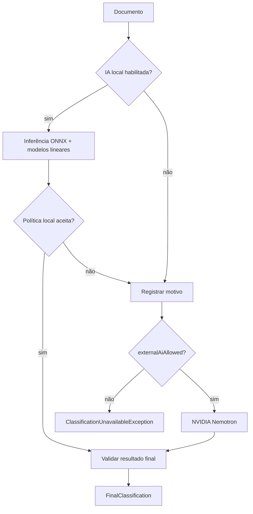

# Modelo interno de IA

## 1. O que está em produção

O runtime do Scripto **não executa Python nem notebooks**. O backend Java carrega um pacote previamente treinado em:

```text
backend/models/scripto-model-v3/
├── manifest.json
├── scripto_runtime_bundle.json
├── evaluation_metrics.json
├── onnx_export_validation.json
├── parity_test.json
└── embedding/
    ├── model.onnx
    ├── tokenizer.json
    ├── tokenizer_config.json
    ├── config.json
    └── onnx_contract.json
```

O artefato ONNX tem aproximadamente **470.259.092 bytes (~448 MiB / ~470 MB decimais)**. Na arquitetura do projeto ele é tratado operacionalmente como um modelo de cerca de **467 MB**.

## 2. Encoder semântico

O bundle runtime declara:

| Propriedade | Valor |
|---|---|
| Modelo base | `sentence-transformers/paraphrase-multilingual-MiniLM-L12-v2` |
| Dimensão | 384 |
| Idiomas de entrada | `pt-BR`, `en` |
| Máximo de tokens | 128 |
| Pooling | mean pooling usando attention mask, dentro do ONNX |
| Normalização | L2 dentro do ONNX |
| Output | `sentence_embedding` |
| ONNX opset | 17 |

O teste de exportação registra similaridade cosseno mínima de aproximadamente **0,99999982** entre referência e ONNX nas amostras de validação, com erro absoluto máximo de aproximadamente `1,27e-7`.

## 3. Estrutura do classificador

O `LocalClassificationEngine` executa três famílias de previsão.

### 3.1 Categoria

1. concatena título e conteúdo no template:

```text
[TITLE]
<título>

[CONTENT]
<conteúdo>
```

2. gera embedding 384-D;
3. aplica classificador linear com probabilidades;
4. escolhe a classe de maior probabilidade;
5. calcula distância/similaridade aos centróides para detecção OOD.

O modelo linear local possui **48 classes diretamente suportadas**. A taxonomia final contém 49 categorias, incluindo `Other`, que exige fallback/sugestão externa quando selecionada.

### 3.2 Dificuldade

A dificuldade não usa diretamente apenas o embedding. O backend extrai oito features manuais compatíveis com o notebook/exportação:

- `log_word_count`;
- `average_sentence_length`;
- `lexical_diversity`;
- `code_marker_density`;
- `advanced_marker_density`;
- `beginner_marker_density`;
- `heading_density`;
- `symbol_density`.

Depois aplica normalização por média/desvio exportados e um classificador linear para:

- `BEGINNER`;
- `INTERMEDIATE`;
- `ADVANCED`.

### 3.3 Tags

O classificador de tags possui **150 classes**. Cada tag usa probabilidade independente; o backend:

- aceita tags com probabilidade >= `0.75`;
- limita a 5 tags;
- se nenhuma passa o threshold principal, pode resgatar a melhor tag quando >= `0.25`.

## 4. Política de aceitação local

O objetivo não é aceitar toda inferência local. O modelo possui uma política explícita de confiança.

| Regra | Threshold/condição |
|---|---|
| confiança mínima da categoria | `0.30` |
| confiança mínima da dificuldade | `0.45` |
| threshold de tag | `0.75` |
| rescue threshold de tag | `0.25` |
| máximo de tags | `5` |
| similaridade mínima OOD | `0.608051598...` |

Motivos de fallback modelados:

- `LOCAL_MODEL_ERROR`;
- `INVALID_EMBEDDING`;
- `UNSUPPORTED_CATEGORY`;
- `OTHER_REQUIRES_FALLBACK`;
- `LOW_CATEGORY_CONFIDENCE`;
- `OUT_OF_DISTRIBUTION`;
- `LOW_DIFFICULTY_CONFIDENCE`;
- `NO_VALID_TAGS`;
- além de motivos orquestracionais como modelo local desabilitado ou IA externa não autorizada.

## 5. Orquestração local → fallback



O fallback **não é uma segunda opinião sempre ativa**. Ele só é usado quando necessário pela política e permitido pelo usuário.

## 6. Nemotron

Configuração padrão do código:

```text
base URL: https://integrate.api.nvidia.com/v1/chat/completions
model: nvidia/nemotron-3-super-120b-a12b
connect timeout: 5 s
read timeout: 45 s
max attempts: 2
```

Para classificação, o prompt exige JSON com:

```json
{
  "category": "categoria exata da taxonomia",
  "difficulty": "BEGINNER|INTERMEDIATE|ADVANCED",
  "tags": ["1 a 5 tags em inglês"],
  "suggestedCategory": null
}
```

Se a categoria for `Other`, `suggestedCategory` deve ser preenchida com uma sugestão não vazia e diferente de `Other`.

O client valida categoria contra a taxonomia, normaliza tags, rejeita respostas vazias/truncadas e repete apenas falhas transitórias (429/5xx/comunicação), até o limite configurado.

## 7. Resumos

A geração de resumo também usa Nemotron. O backend:

- solicita uma resposta textual curta;
- desabilita reasoning para essa operação (`reasoning_effort=none`);
- limita o texto final a 20 palavras;
- limita a 250 caracteres;
- persiste em MySQL e reutiliza por cache;
- aplica cota de 3 novas gerações/dia/usuário.

O resumo **não faz parte da inferência local de classificação** na versão atual.

## 8. Métricas do bundle atual

Arquivo fonte: `backend/models/scripto-model-v3/evaluation_metrics.json`.

### Teste interno

| Métrica | Valor aproximado |
|---|---:|
| Registros | 490 |
| Acurácia bruta de categoria | 98,78% |
| F1 macro de categoria | 96,65% |
| Cobertura após política de aceitação | 92,24% |
| Precisão de categoria entre aceitos | 99,56% |
| Acurácia de dificuldade | 83,27% |
| F1 macro de dificuldade | 82,99% |
| F1 micro de tags | 98,93% |

### Golden set combinado

| Métrica | Valor aproximado |
|---|---:|
| Registros | 160 |
| Acurácia bruta de categoria | 55,00% |
| Cobertura após política de aceitação | 11,88% |
| Precisão de categoria entre aceitos | 73,68% |
| Acurácia de dificuldade | 35,63% |
| F1 micro de tags | 37,41% |

Por idioma no golden set:

- pt-BR: 80 registros; cobertura 13,75%; precisão entre aceitos 81,82%;
- inglês: 80 registros; cobertura 10%; precisão entre aceitos 62,5%.

### Interpretação

A diferença grande entre teste interno e golden set indica **generalização limitada / mudança de distribuição**. A política OOD/fallback reduz a cobertura e evita aceitar parte das inferências arriscadas, mas não elimina o gap. Portanto:

- não documente o modelo apenas pela acurácia interna;
- monitore taxa de fallback e qualidade por categoria/idioma;
- trate golden set como evidência de risco real de distribuição;
- não remova thresholds apenas para aumentar cobertura sem revalidação.

## 9. Persistência para recomendação e melhoria do modelo

Quando pgvector está habilitado, `PostgresVectorStore` registra:

- `document_embeddings`: vetor 384-D por documento;
- `inference_events`: fonte final, versão local, modelo externo, fallback reasons e resultados;
- `training_candidates`: snapshots consentidos e resultado final.

Candidatos podem ter status como `CANDIDATE`, `APPROVED`, `REJECTED` e `IN_TRAINING` no frontend/admin.

O endpoint de exportação gera JSONL de candidatos aprovados para uso fora do runtime.

## 10. Consentimentos

Há duas decisões diferentes:

1. `externalAiAllowed`: autoriza envio do conteúdo ao provedor externo quando o fallback for necessário;
2. `trainingUseAllowed`: autoriza retenção do conteúdo para melhoria do modelo interno.

No contrato atual, `trainingUseAllowed` é obrigatório e deve ser verdadeiro para enviar um documento. Isso é uma decisão de produto, não uma necessidade técnica intrínseca do modelo.

## 11. Histórico de Data Science

`data/Juliana/` contém notebooks e documentação de versões anteriores do pipeline. Esses materiais são importantes como histórico, mas alguns detalhes não representam o runtime final — por exemplo, documentação antiga cita `all-MiniLM-L6-v2` e um conjunto diferente de categorias/dataset.

Para operação atual, a fonte de verdade é:

1. `scripto_runtime_bundle.json`;
2. `manifest.json`;
3. `evaluation_metrics.json`;
4. implementação Java em `classification/`.

## 12. Requisitos para trocar o modelo

Uma nova versão deve preservar/atualizar de forma coordenada:

- tokenizer;
- contrato ONNX de inputs/outputs;
- dimensão do embedding;
- nomes/classes de categoria;
- classes de tags;
- features de dificuldade;
- médias/desvios das features;
- thresholds de aceitação;
- centróides OOD;
- testes de paridade Java/Python;
- migrations/schema pgvector se a dimensão mudar;
- documentação e métricas.

Se a dimensão deixar de ser 384, a coluna `vector(384)` e o índice pgvector também precisam de migração.
