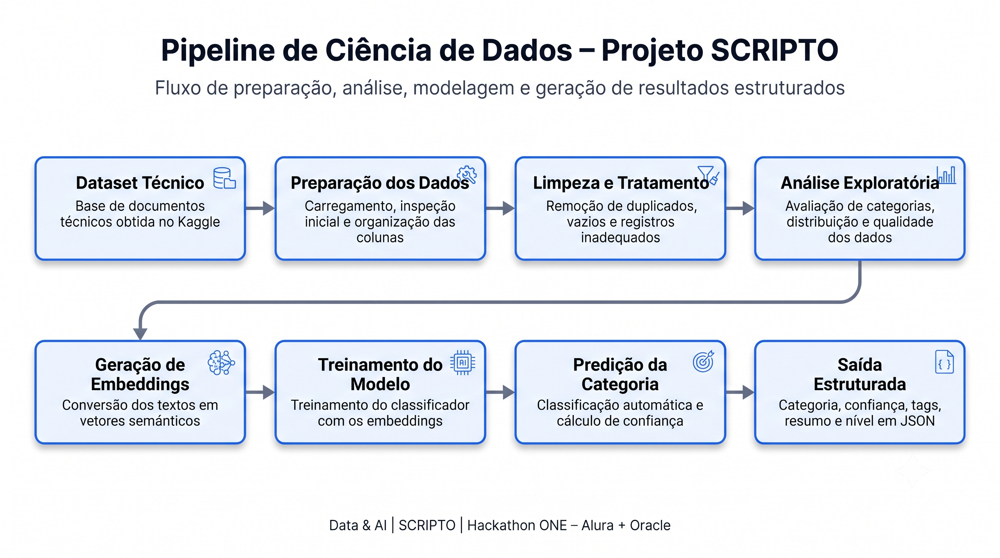
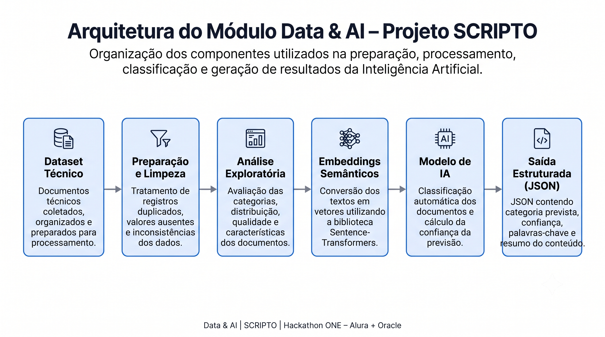
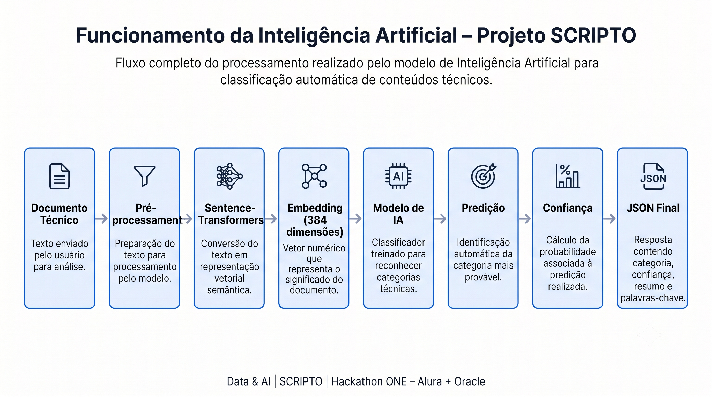

# 📊 Data - Projeto SCRIPTO


## Visão Geral

A pasta **data** concentra toda a estrutura de Ciência de Dados e Inteligência Artificial desenvolvida para o projeto **SCRIPTO** durante o Hackathon ONE (Oracle + Alura).

Aqui estão organizados os datasets, notebooks de preparação, pipelines de Inteligência Artificial e documentos técnicos utilizados para construção da solução.

## Pipeline de Ciência de Dados

O fluxo abaixo apresenta todas as etapas desenvolvidas no módulo de Dados, desde a preparação do dataset até a geração da saída estruturada da Inteligência Artificial.



---

## Arquitetura do Módulo Data & AI

A arquitetura abaixo apresenta os principais componentes utilizados na preparação, processamento, classificação e geração da saída estruturada da Inteligência Artificial.



---
## Tecnologias Utilizadas

Este módulo foi desenvolvido utilizando ferramentas e bibliotecas voltadas para Ciência de Dados, Processamento de Linguagem Natural e Machine Learning.

---

## Tecnologias Utilizadas

Este módulo foi desenvolvido com ferramentas e bibliotecas voltadas para Ciência de Dados, Processamento de Linguagem Natural, Machine Learning e organização de documentos técnicos.

| Tecnologia | Finalidade |
|---|---|
| **Python** | Desenvolvimento dos scripts, funções e pipelines de processamento |
| **Pandas** | Leitura, limpeza, transformação e análise dos dados |
| **NumPy** | Operações numéricas e armazenamento dos embeddings |
| **Sentence-Transformers** | Geração de embeddings semânticos a partir dos textos |
| **all-MiniLM-L6-v2** | Modelo utilizado para gerar vetores semânticos com 384 dimensões |
| **scikit-learn** | Treinamento do classificador, predição das categorias e cálculo de confiança |
| **Similaridade de Cosseno** | Comparação entre embeddings e identificação de documentos semelhantes |
| **PyArrow** | Leitura e escrita dos datasets armazenados em formato Parquet |
| **Jupyter Notebook / Google Colab** | Desenvolvimento, execução e documentação dos experimentos |
| **Kaggle** | Origem do dataset de documentos técnicos utilizado no projeto |
| **Git e GitHub** | Versionamento, organização dos arquivos e colaboração com a equipe |
| **JSON** | Formato estruturado de saída para integração com outras aplicações |

> O módulo **Data & AI** utiliza técnicas de Processamento de Linguagem Natural e Machine Learning para organizar, representar, classificar e recomendar documentos técnicos de forma automática.

---
---

## Fluxo dos Arquivos e Notebooks

Os notebooks da área de Dados foram organizados em uma sequência lógica de execução, permitindo acompanhar todas as etapas do projeto desde a análise inicial até a geração do modelo de Inteligência Artificial.

```text
Dataset Técnico
      ↓
01_EDA.ipynb
      ↓
02_Limpeza.ipynb
      ↓
03_Modelo_IA_SCRIPTO.ipynb
      ↓
Embeddings e Classificação
      ↓
Busca Semântica e Recomendação
      ↓
Saída Estruturada em JSON

## Funcionamento da Inteligência Artificial

O diagrama abaixo apresenta o fluxo completo executado pelo modelo de Inteligência Artificial, desde o recebimento do documento técnico até a geração da saída estruturada em JSON.
```


# Objetivo

Esta estrutura foi criada para organizar todas as etapas relacionadas ao processamento dos dados, desde a obtenção do dataset até a geração das previsões realizadas pelo modelo de Inteligência Artificial.

---

# Estrutura da pasta

```text
data/
│
├── datasets/
│   ├── README.md
│   └── base_de_dados_artigos.csv
│
├── ia/
│   ├── README.md
│   ├── modulo_ia_v1/
│   └── modulo_ia_v2/
│
└── stackoverflow/
    ├── README.md
    └── 04_Preparacao_Dataset_StackOverflow.ipynb
---
---

# Resultados Obtidos

O módulo Data & AI implementa um pipeline completo para processamento, representação semântica e classificação automática de documentos técnicos, gerando uma saída estruturada em formato JSON para integração com outras aplicações.

### Principais resultados

- Organização automática de documentos técnicos.
- Conversão de textos em embeddings semânticos utilizando Sentence Transformers.
- Classificação automática das categorias dos documentos.
- Cálculo da confiança da previsão realizada pelo modelo.
- Geração de uma resposta estruturada em JSON para integração com outras aplicações.
- Arquitetura preparada para integração com Backend Java (Spring Boot).

### Exemplo de saída JSON

```json
{
  "categoria": "Backend",
  "confianca": 0.96,
  "tags": [
    "API",
    "Java",
    "Spring"
  ],
  "resumo": "Documento relacionado ao desenvolvimento Backend.",
  "nivel": "Intermediário"
}
```
---

# 📊 Métricas do Dataset

O desenvolvimento do módulo **Data & AI** foi baseado na análise e processamento de uma base pública de documentos técnicos, permitindo construir um pipeline consistente para classificação automática de conteúdos.

| Métrica | Valor |
|---------|------:|
| Dataset de origem | Kaggle |
| Total de documentos analisados | **2.900** |
| Documentos após limpeza | **2.879** |
| Documentos README utilizados na IA | **941** |
| Dimensão dos embeddings | **384** |
| Modelo de embeddings | **all-MiniLM-L6-v2 (Sentence Transformers)** |
| Modelo de classificação | **Scikit-learn** |
| Formato de saída | **JSON** |

### Categorias identificadas

| Categoria | Quantidade |
|-----------|-----------:|
| Documentação | 941 |
| Licenças | 645 |
| Dependências | 322 |
| Contribuição | 262 |
| Histórico de Alterações | 195 |
| Governança | 130 |
| Segurança | 122 |
| Configuração de Linguagem | 118 |
| Configuração Python | 72 |
| Configuração Java | 72 |
| Outros | 781 |

> Todas essas métricas foram obtidas durante as etapas de preparação, limpeza e análise exploratória do dataset, servindo como base para o treinamento e validação do pipeline de Inteligência Artificial.


---


# Arquitetura da área de Dados

```text
                   DATA
                     │
      ┌──────────────┼──────────────┐
      │              │              │
      ▼              ▼              ▼
 StackOverflow    Datasets        IA
      │              │              │
      ▼              ▼              ▼
Preparação      Dataset Final   Modelos
      │              │              │
      └──────────────┼──────────────┘
                     ▼
            Classificação Inteligente
```

Esta organização separa as responsabilidades da equipe de Dados em três módulos principais:

- **StackOverflow:** preparação e tratamento do dataset original.
- **Datasets:** armazenamento das bases consolidadas.
- **IA:** treinamento, experimentação e evolução dos modelos utilizados pelo projeto.
```

---

# Fluxo de processamento

```text
Dataset Original
        │
        ▼
Preparação dos Dados
        │
        ▼
Limpeza e Padronização
        │
        ▼
Geração do Dataset Final
        │
        ▼
Treinamento do Modelo de IA
        │
        ▼
Classificação de Conteúdos Técnicos
```

---

# Organização

## 📁 datasets

Contém os conjuntos de dados utilizados durante o desenvolvimento do projeto.

Inclui o dataset preparado e documentado para utilização pelo pipeline de IA.

---

## 🤖 ia

Reúne todas as versões do módulo de Inteligência Artificial.

Nesta pasta encontram-se os experimentos, pipelines e evoluções desenvolvidas durante o Hackathon.

---

## 📊 stackoverflow

Contém o notebook responsável pela preparação do dataset StackExchange StackOverflow.

Nesta etapa foram realizadas atividades como:

- exploração dos dados;
- limpeza;
- padronização;
- tratamento;
- exportação do dataset final.

---

## Tecnologias Utilizadas

| Categoria | Tecnologias |
|-----------|-------------|
| Linguagem | Python |
| Manipulação de Dados | Pandas, NumPy |
| Machine Learning | Scikit-Learn |
| Processamento de Linguagem Natural | Sentence Transformers |
| Desenvolvimento | Jupyter Notebook |
| Versionamento | Git e GitHub |

------

# Próximas Evoluções

O módulo **Data & AI** foi desenvolvido de forma modular, permitindo futuras evoluções sem impacto significativo na arquitetura atual.

As principais melhorias previstas são:

- Implementação de Fine-tuning do modelo de classificação.
- Suporte a novos formatos de documentos técnicos.
- Busca semântica utilizando banco vetorial.
- Integração completa com Oracle Cloud Infrastructure (OCI).
- Exposição do modelo por meio de API REST.
- Monitoramento de métricas do modelo em produção.
- Automatização do pipeline de treinamento.

---

# Autora

**Juliana Ferreira dos Santos Magalhães**

Responsável pelo módulo **Data & AI**, incluindo:

- Engenharia e preparação dos dados;
- Análise Exploratória (EDA);
- Limpeza e tratamento do dataset;
- Geração de embeddings semânticos;
- Desenvolvimento do pipeline de Inteligência Artificial;
- Classificação automática dos documentos;
- Estruturação da saída em JSON;
- Documentação técnica da área de Dados.

---

> Desenvolvido durante o **Hackathon ONE – Oracle Next Education (Oracle + Alura)**.

---

Projeto desenvolvido durante o **Hackathon**.
